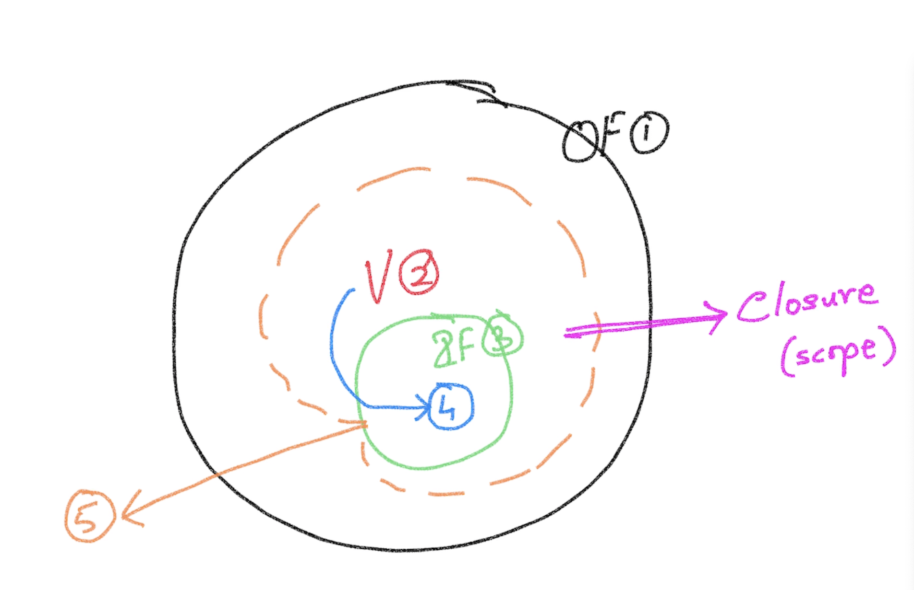

# Closures

## Steps for creating a closure
1. Outer Function
2. A variable in the Outer Function
3. Inner Function
4. Refer the variable from the Outer Function in the Inner Function
5. Extend the lifetime of the Inner Function beyond the lifetime of the Outer Function

## Memoization
- Memorize the result of a function

## Pure function
- A function with NO side-effects
- If the invocation of the function can be replaced with the result of the function without affecting the outcome
- Always returns the same result for the the given inputs 