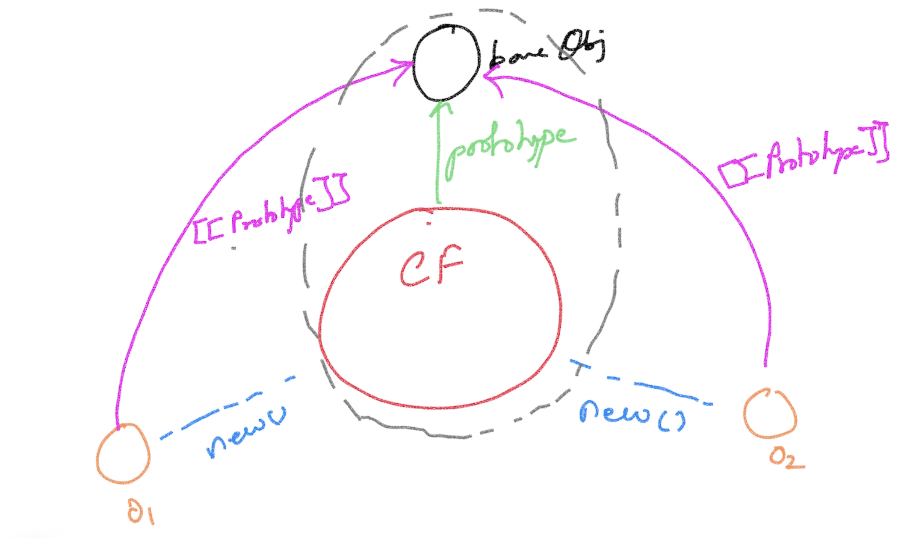

# Prototypal Inheritance
- One object acts as the base object for a family of objects
- The relationship with the base object is maintained using '[[Prototype]]' attribute
- The ConstructorFunction.prototype is the base object
- instance.[[prototype]] == ConstructorFunction.prototype
- ConstructorFunction.prototype is used to hold the methods
- Prototype hopping occurs ONLY when an attribute value is 'read'

